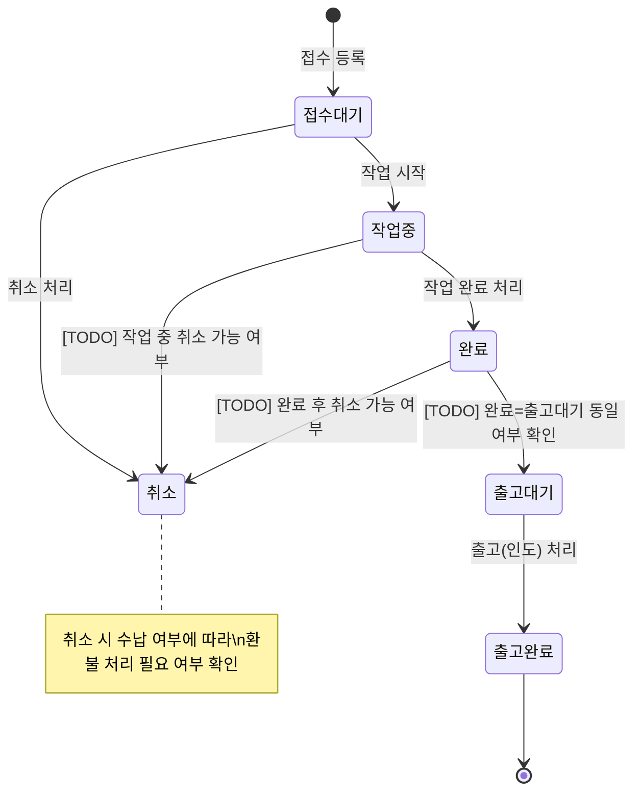
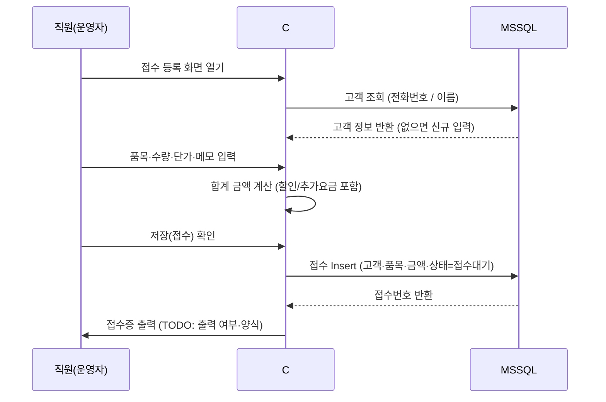
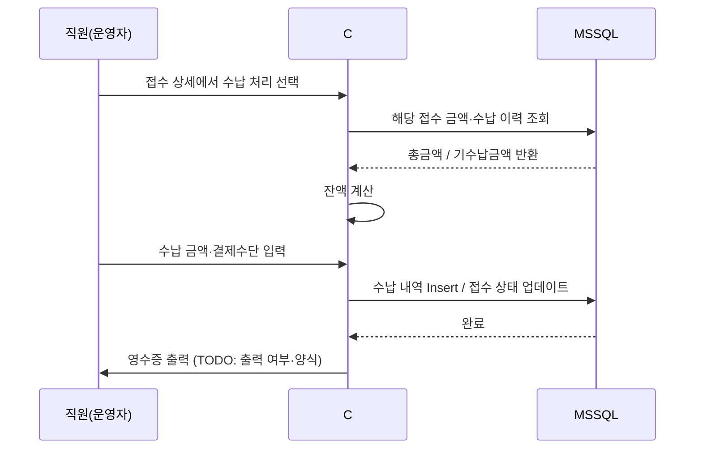

# 레거시 분석서 (통합본)

> 차세대(`TKLaundry Next`) 전환을 위한 **레거시(C# WinForms) 시스템 as-is 기록**을 한 파일에서 볼 수 있게 묶었다.
>
> - **Part A**: 요약·빠른 참조
> - **Part B**: `[TODO]` 확정 방식 체크리스트 (`00_레거시_분석_TODO_정리` 대응)
> - **Part C**: 상세 as-is (`00_레거시_분석(as-is)` 대응)

공개 저장소용으로 **매장명·실명·로컬 PC 경로** 등 식별 가능한 표현은 제거하거나 일반화했다.

---

## Part A. 요약 (한눈에)

| 구분 | 내용 |
|------|------|
| 앱 | C# WinForms + DevExpress, DB 직접 접근, 별도 API 없음 |
| DB | SQL Server Express, DB명 `TKLaundry` |
| 배포 | 실행 폴더(`bin`) 복사, 바탕화면 바로가기(실행 파일명은 배포 환경에 따름) |
| 동시성 | 단일 사용자(매장 PC 로컬) 전제 |
| 핵심 테이블 | `OrderMaster` / `OrderDetail`, `ComCustomer`, `ComProduct`, `ComBaseData`, `Sales*`, `Delivery*`, `AutoNumber` |
| 코드 마스터 | `ComBaseData` 트리(`PCodeID`: `ROOT` → `B00001` → …). 접수·매출 화면의 상태 콤보는 `B00001` → `B10001` 하위 코드를 사용 |
| 문서/스크립트 | 공통코드 시드 예시는 저장소 `docs/sql/combasedata.sql`, 스키마+시드 통합은 `docs/sql/init.sql` |

### 코드(`ComBaseData`) 메모

문서에 **「결제 구분」**으로 적혀 있는 `B20001/B20002/B20005`(일반·선불·외상)는 실제로 **`OrderMaster.Status` 등에 들어가는 `char(6)` 코드**이며, 화면에서는 `B10001` 그룹(상태) 하위로 바인딩된다. 운영 명칭과 DB 코드 의미를 혼동하지 않도록 주의한다.

---

## Part B. TODO 확정 체크리스트

### 레거시 분석 TODO 정리 — 작성 체크리스트

> 기준 문서: 아래 **Part C**에 남아있는 `[TODO]`들을 “무슨 방식으로 확정할지” 기준으로 분류했다.  
> 표기:
> - **[DB]**: DB에서 쿼리/스키마로 확인 가능
> - **[정책]**: 운영/업무 정책 결정(정답이 DB에만 있지 않음)
> - **[관찰]**: 운영자 관찰/인터뷰로만 확정 가능

---

## 1) [DB] DB로 확인하면 끝나는 것(가능하면 먼저 처리)

- **고객 전화번호 유니크/인덱스 여부**
  - `ComCustomer.CustPhone`에 유니크/인덱스/제약이 있는지
- **상태 이력 테이블 존재 여부**
  - 레거시가 `상태이력`을 별도 테이블로 남기는지(없다면 “현재 상태만” 저장)
- **접수일/집계 기준 컬럼 후보**
  - `OrderMaster.OrderDate` 외에 상태변경일/출고일/매출일 등 “대조 기준”이 될 날짜 컬럼들 정리

---

## 2) [정책] 차세대 설계에 직접 영향 주는 운영/업무 정책(우선순위 높음)

### 2.1 권한/계정 정책
- **권한 구분 방식**
  - 현재는 로그인(ComMember)만 확인됨 → “관리자 1-role 유지”로 갈지, 직원/조회전용 등 확장할지

### 2.2 화면/기능 범위 확정
- **고객 관리**: 별도 화면 실제 사용 여부(레거시에서 사용 빈도)
- **일계표/정산**: 화면 구성(어떤 지표를 어떤 기준으로 보나)
- **환경 설정**: 실제로 쓰는 항목(단가표/매장정보/기타)
- **메뉴 트리/폼 목록 확정**
  - 소스 Form 목록으로 “기능 목록 표” 보완(문서 2장)

### 2.3 상태/업무 규칙(병행 운영 대조의 핵심)
- **완료=출고대기 동일 여부**
- **취소 가능 구간**
  - 작업중 취소 가능 여부
  - 완료 후 취소 가능 여부
- **상태 역전 가능 여부**
  - 완료 → 작업중 같은 역전이 가능한지(관리자 전용 포함)
- **취소건 집계 포함 여부**
- **출고 처리 시 수납 완료 강제 여부**
  - 미납이면 경고만? 차단? (외상 포함)
- **접수 수정 가능 범위**
  - 출고된 상세가 있으면 수정 불가(레거시 로직 존재) → 정책 문서화 필요

### 2.4 접수 등록/금액 정책
- **품목 입력 방식**
  - 마스터 선택만인지 / 자유 입력이 있는지
- **할인/추가요금 정책**
  - 정률/정액, 라인별/전체, 반올림/절사(현재는 int 기반이나 정책은 문서화 필요)
- **선수금(착수금) 수납 여부**

### 2.5 수납/결제 정책(현 구조는 Sales* 기반)
- **결제수단 종류/저장 방식**
  - 현금/카드/이체…를 어떻게 기록할지(현재는 BankingYn + Status(일반/선불/외상) 조합으로 보임)
- **부분수납(분납) 가능 여부**
- **수납 취소/수정 가능 여부**
- **혼합 결제(카드+현금) 허용 여부**

### 2.6 엣지 케이스 정책(대조 불일치 원인)
- 고객 전화번호 미입력 접수 허용 여부
- 0원 접수 허용 여부
- 출고 후 클레임 재처리 방식(재접수 vs 원접수 재오픈)
- 날짜가 바뀌는 시점의 “미완료 건” 대조 기준
- 수납 초과 입금 허용/경고/차단

---

## 3) [관찰] 운영자 습관/우회 동작(차세대 UX에 결정타)

> 문서 4.4(W-01~)에 넣을 내용. “지금은 이렇게 해야 빨리 된다” 류의 습관이 병행 기간 클레임으로 직결됨.

- **W-01** 실제 운영 루틴(오픈~마감까지)
  - 자주 쓰는 화면 순서, 단축 동작(키/마우스), “항상 이렇게 입력” 규칙
- **W-02~** 불편해서 우회하는 행동
  - 예: 취소 대신 메모로 처리, 외상/선불 처리 순서, 출고 처리 타이밍 등
- **오류/불일치가 났을 때 운영자 대응 방식**
  - 다시 입력/삭제/수정/메모 기록 등

---

## 4) “레거시 특유의 이상한 규칙(Q-01/Q-02)” 작성 템플릿

아래 형식으로 Q-01~을 채우면 차세대 설계/대조 시 도움이 된다.

- **발견 내용**: (예: `OrderDate` 조회는 날짜만 쓰지만 저장은 ms 포함, 필터는 EndDate+1로 처리)
- **발생 조건/재현**: 언제/어떤 화면에서
- **DB 증거**: 관련 테이블/컬럼/샘플 row
- **운영 영향**: 누락/중복/오해 가능성
- **차세대 대응**: “동일 유지”인지 “개선”인지 + 병행기간 대조 방법

---

## 5) P0 “쓰기 1개” 추천(정리)

문서(PRD/테스크/DB병행) 흐름상 P0 쓰기는 1개로 시작이 안전하다.

- 후보 A: **출고 처리**
  - 레거시에 이미 `Delivery*` + `Sales*` + `CompleteYn` 업데이트로 업무가 엮여 있음(규칙 확인 필요)
- 후보 B: **완료 처리**
  - 완료가 어떤 의미인지(출고대기 포함 여부)부터 정의가 필요

> 결론: “가장 자주 하는 업무 1개”를 P0 쓰기로 잡고, 그 업무의 영향 테이블(쓰기 범위)을 05 문서의 쓰기 담당표에 고정하는 것을 권장.

---

## Part C. 상세 as-is 본문

### 레거시 분석(as-is) — TKLaundry (C# / DevExpress)

> **목적**: 차세대 전환 전에 "기존 시스템이 실제로 어떻게 동작하는지"를 기록한다.  
> 이 문서는 차세대 구현의 **기준(정답지)** 이며, 01~06 문서 작업 전에 먼저 확인한다.
>
> - `[확인됨]` — 레거시 소스/운영 확인 완료  
> - `[TODO]` — 레거시 소스 또는 DB 직접 확인 필요  
> - `[추정]` — PRD/운영 경험 기반 추정(확인 권장)

---

## 1. 기존 시스템 개요

### 1.1 기술 스택

| 항목 | 내용 |
|------|------|
| 프로젝트명 | TKLaundry |
| 클라이언트 | C# WinForms / DevExpress (v19.2.5) `[확인됨]` |
| 백엔드 | C# 애플리케이션 (DB 직접 접근, 별도 API 서버 없음) `[확인됨]` |
| DB | MSSQL (SQL Server **2019**, `SQLEXPRESS`, DB명: `TKLaundry`) `[확인됨]` |
| 인증 방식 | 로그인 화면 있음 (`FrmLogIn`) + DB `ComMember`에서 `UserID/UserPW/UseYn='Y'`로 검증 `[확인됨]` / 권한 구분: `[TODO]` (현재는 단일 role 가능성 높음) |
| 배포 방식 | `bin` 폴더 복사 후 `TKLaundry.exe` 바로가기 생성(바탕화면). 배포 시 수동 복사/교체 `[확인됨]` |
| 인쇄/라벨 | 연동 장비 없음(접수증/영수증/라벨 출력 없음) `[확인됨]` |

### 1.2 실행 환경

| 항목 | 내용 |
|------|------|
| 운영 PC | 매장 PC (Windows, 로컬 실행) |
| DB 위치 | **매장 PC 로컬**(SQL Server Express) `[확인됨]` |
| 네트워크 | 매장 내부 LAN 전용, 외부 접근 없음 |
| 동시 사용자 | 1명(단독) `[확인됨]` |

### 1.3 운영 기간 / 유지보수 현황

| 항목 | 내용 |
|------|------|
| 운영 시작 시점 | 데이터 기준 2021-09경 추정 `[확인됨]` |
| 마지막 업데이트 | 2024-04 (수동 기록) `[확인됨]` |
| 유지보수 담당 | 소규모 단일 담당 `[확인됨]` |
| 알려진 미해결 버그 | 문서화된 목록 없음(현재 정상 사용 중) `[확인됨]` |
| 데이터 규모 (추정) | `SalesMaster` 기준 26,012건 `[확인됨]` |

---

## 2. 기존 화면/기능 목록

> 우선순위: P0 = 차세대 첫 병행에 반드시 동등 구현, P1 = 안정화 후, P2 = 선택  
> 사용 빈도: ★★★ 매일 / ★★☆ 자주 / ★☆☆ 가끔 / ☆☆☆ 거의 안 씀

| # | 화면/메뉴명 | 주요 기능 요약 | 사용 빈도 | 전환 우선순위 | 비고 |
|---|------------|--------------|:--------:|:------------:|------|
| 1 | 접수 목록 | 기간/상태/고객 필터 + 건수·총액 합산 | ★★★ | P0 | 핵심 메인화면 |
| 2 | 접수 상세 | 1건 상세 조회 (품목·금액·메모·상태이력) | ★★★ | P0 | |
| 3 | 상태 변경 | 완료·출고 등 상태 전이 처리 | ★★★ | P0 | 쓰기 1개로 시작 |
| 4 | 접수 등록 | 신규 접수 입력 (고객·품목·금액) | ★★★ | P1 | |
| 5 | 수납/결제 | 결제 금액 입력·수납 처리 | ★★☆ | P1 | 규칙 복잡 |
| 6 | 고객 관리 | 고객 목록·상세·수정 | ★★☆ | P1 | `[TODO]` 별도 화면 여부 |
| 7 | 일계표/정산 | 일별·기간별 매출 집계 리포트 | ★★☆ | P2 | `[TODO]` 화면 구성 |
| 8 | 환경 설정 | 매장 정보·단가표·프린터 설정 등 | ★☆☆ | P2 | `[TODO]` 세부 항목 |

> `[TODO]` 실제 메뉴 트리 캡처 또는 소스의 Form 목록으로 위 표를 보완할 것.  
> `[TODO]` 사용 빈도는 운영자 인터뷰 또는 실제 사용 관찰로 보정할 것.

### 2.1 전환 우선순위 판단 근거

| 판단 기준 | 내용 |
|----------|------|
| P0 기준 | 병행 운영 대조에 반드시 필요한 "읽기 + 핵심 쓰기 1개" |
| P1 기준 | 차세대 단독 운영을 위해 필요하나, 초기 병행에선 레거시가 대신함 |
| P2 기준 | 없어도 단기 운영 가능하거나, 레거시 방식 그대로 계속 써도 무방 |
| 제외 기준 | 거의 사용 안 하거나, 차세대에서 설계 변경이 예상되는 것 |

---

## 3. 기존 DB 구조 파악

> 아래는 PRD/운영 기반 추정 초안이다.  
> **확인 방법**: `INFORMATION_SCHEMA.TABLES` + `INFORMATION_SCHEMA.COLUMNS` 조회, 또는 C# 소스 DAL/SQL 파일에서 테이블명 추출.

### 3.1 핵심 테이블 목록 (추정)

| 테이블명 | 역할 추정 | 주요 컬럼 (추정) | 확인상태 |
|---------|---------|----------------|:-------:|
| `OrderMaster` | 접수(오더) 헤더 | `OrderNo`(채번), `OrderDate`, `CustCode`, `Qty`, `Discount`, `Cost`, `Status`, `BankingYn`, `DeliveryDate`, `CompleteYn` | `[확인됨]` |
| `OrderDetail` | 접수(오더) 상세 | `OrderNo`, `OrderSeq`, `ProductCode`, `ProcessCode`, `Price`, `Qty`, `Discount`, `Cost`, `CompleteYn`, `Remark` | `[확인됨]` |
| `ComCustomer` | 고객 마스터 | `CustCode`(예: `C0001`), `CustName`, `CustPhone`, `AptCode/BuildingCode/FloorCode/RoomCode` | `[확인됨]` |
| `ComProduct` | 품목/단가 마스터 | `ProductCode`, `ProductName`, `Price`, `ProcessCode`, `GroupCode` 등 | `[확인됨]`(모델/화면 사용 확인) |
| `ComMember` | 사용자(로그인) | `UserID`, `UserPW`, `UserName`, `UseYn`, `LogInDate` | `[확인됨]` |
| `ComBaseData` | 공통 코드/분류 | 코드 그룹(`B00001` 등) + 하위 코드(`B10001` 상태, `B10002` 공정/그룹 등) | `[확인됨]`(화면 바인딩 확인) |
| `AutoNumber` | 문서번호 시퀀스 | `DocName`(예: 접수/매출/출고), `DocDate`(yyMMdd), `Seq` | `[확인됨]` |
| `SalesMaster` | 매출 헤더 | `SalesNo`, `SalesDate`, `CustCode`, `Qty`, `Discount`, `Cost`, `Status`, `BankingYn`, `SalesYn` | `[확인됨]`(모델/화면 사용 확인) |
| `SalesDetail` | 매출 상세 | (접수 상세 + 매출 연결: `OrderNo/OrderSeq` 포함) | `[확인됨]`(화면 로직 사용 확인) |
| `DeliveryMaster` | 출고 헤더 | `DeliveryNo`, `OrderDate`, `CustCode`, `Qty`, `Discount`, `Cost`, `Status`, `BankingYn`, `DeliveryDate` | `[확인됨]`(화면 로직 사용 확인) |
| `DeliveryDetail` | 출고 상세 | (접수 상세 + 출고 연결: `OrderNo/OrderSeq` 포함) | `[확인됨]`(화면 로직 사용 확인) |

### 3.2 핵심 컬럼 상세 (확인 필요 목록)

- [x] 접수 헤더 채번 방식: `OrderNo = 'O' + yyMMdd + '-' + Seq(3자리)` (`AutoNumber` 테이블 사용, `DocName='접수'`) `[확인됨]`
- [x] 접수 헤더 PK/제약: `OrderMaster(OrderNo)` PK 존재(`[PK_OrderMaster]`) `[확인됨]` (docs/sql/schema.sql 또는 init.sql)
- [x] 접수 상태 컬럼: `OrderMaster.Status char(6) NULL`(`[확인됨]`) / 코드 매핑은 `ComBaseData(CodeID char(6), PCodeID char(6))` `[확인됨]`
  - 코드값(결제 구분으로 사용): `B20001=일반`, `B20002=선불`, `B20005=외상` (`PCodeID=B10001`) `[확인됨]` (docs/sql/combasedata.sql)
- [x] 접수일 컬럼 타입: `OrderMaster.OrderDate datetime NULL` `[확인됨]`
- [x] 금액/수량 컬럼 타입: `Qty/Discount/Cost int NULL`, `Price int NULL`(`[OrderDetail]`) `[확인됨]`
- [x] 접수 완료/출고 여부: `CompleteYn = 'Y'/'N'` (`OrderMaster`, `OrderDetail`) `[확인됨]`
- [ ] 고객 전화번호 유니크 제약 여부(`[TODO]`): 레거시는 고객 중복 판별을 주소코드(Apt/Building/Floor/Room)로 확인하는 로직이 존재함(전화번호는 단순 컬럼) — 제약은 DB에서 확인 필요
- [x] 수납 테이블: 별도 “수납” 테이블 대신 `SalesMaster/SalesDetail`로 매출(선불/외상/일반) 처리를 하는 구조로 보임 `[확인됨]` (정확한 의미는 코드/DB 확인 필요)
- [ ] 상태 이력 테이블: 소스 상 별도 이력 테이블 사용은 확인 못함(`[TODO]` DB에서 확인)
- [x] 삭제 정책: 소프트 삭제 없음(레거시에서 `DELETE` 사용) `[확인됨]` / 차세대 전환 이후 소프트삭제 도입 예정

### 3.3 인덱스 / 제약조건 현황

| 테이블 | 인덱스/제약 추정 | 확인상태 |
|-------|----------------|:-------:|
| 접수 헤더 | PK: `PK_OrderMaster(OrderNo)` `[확인됨]` / (접수일 인덱스는 스크립트에 없음) |
| 접수 상세 | PK: `PK_OrderDetail(OrderNo, OrderSeq)` `[확인됨]` |
| 고객 | PK: `PK_ComCustomer(CustCode)` `[확인됨]` / 전화번호 유니크/인덱스: 없음(스크립트 기준) `[확인됨]` |
| 매출/출고 | `PK_SalesMaster(SalesNo)`, `PK_SalesDetail(SalesNo, SalesSeq)`, `PK_DeliveryMaster(DeliveryNo)`, `PK_DeliveryDetail(DeliveryNo, DeliverySeq)` `[확인됨]` |
| 기타 | Stored Procedure / Trigger: 없음 `[확인됨]` |

> `[TODO]` SP/트리거가 있다면 목록을 확보할 것. 차세대가 직접 SQL을 실행할 때 부수효과를 놓칠 수 있음.

### 3.4 레거시 특유의 이상한 규칙 (메모)

> 소스나 DB를 보면서 발견되는 "왜 이렇게 했지?" 싶은 것들을 여기에 기록한다.

| # | 발견 내용 | 추정 이유 | 차세대 대응 |
|---|---------|---------|-----------|
| Q-01 | `[TODO]` 확인 후 채워 넣기 | | |
| Q-02 | `[TODO]` | | |

---

## 4. 기존 업무 프로세스

### 4.1 접수 상태 전이 (핵심)

> 상태 코드값(DB)과 화면 표시명(결제 구분): `B20001=일반`, `B20002=선불`, `B20005=외상` (`ComBaseData`, `PCodeID=B10001`) `[확인됨]`  
> `[추정]` 상태 역전(완료 → 작업중)은 불가하거나 관리자 전용으로 추정 — 확인 필요

---

### 4.2 접수 등록 흐름

> `[TODO]` 품목은 마스터 선택 방식인지, 자유 입력인지 확인  
> `[TODO]` 할인(정률/정액) 또는 추가요금 항목이 있는지 확인  
> `[TODO]` 접수 시 선수금(착수금) 수납 여부

---

### 4.3 수납/결제 흐름

> `[TODO]` 결제수단 종류 (현금/카드/이체 등) 및 DB 저장 방식  
> `[TODO]` 부분 수납(분납) 가능 여부  
> `[TODO]` 수납 취소 또는 수정 가능 여부

---

### 4.4 운영자가 실제로 하는 방법 (공식 흐름 밖)

> "교과서"대로 안 쓰는 실제 운영 습관을 기록한다. 차세대에서 막히면 클레임 원인이 된다.

| # | 행동 패턴 | 발생 이유 | 차세대 대응 |
|---|---------|---------|-----------|
| W-01 | `[TODO]` 운영자 인터뷰·관찰 후 채워 넣기 | | |
| W-02 | `[TODO]` 예) "취소 대신 메모에 '취소'라고 적고 완료 처리" | 취소 버튼이 없거나 불편 | 취소 기능 명시적 제공 |
| W-03 | `[TODO]` | | |

---

## 5. 핵심 비즈니스 규칙

> 코드·운영에 숨어 있어서 놓치면 병행 대조 때 불일치가 나는 규칙들.

| # | 규칙 | 확인상태 | 비고 |
|---|------|:-------:|------|
| R-01 | 상태 역전(완료→작업중 등)은 금지(또는 관리자만 가능) | `[TODO]` | |
| R-02 | 접수번호 채번 방식: `OyyMMdd-###` (`AutoNumber` 사용, `DocName='접수'`) | `[확인됨]` | 차세대 등록 API 설계에 직결 |
| R-03 | 고객 중복 판별 기준 (전화번호 단일 키 여부) | `[TODO]` | |
| R-04 | 총금액 계산 공식: 라인 `Cost = Price × Qty - Discount`, 헤더는 라인 합산(수량/할인/금액 각각 합) | `[확인됨]` | `int` 연산 기반(소수점 없음) |
| R-05 | 대조 건수/총액 기준 필터 (접수일 기준 vs. 상태변경일 기준) | `[추정]` 접수일 기준 | 병행 대조 기준 확정에 필수 |
| R-06 | 취소 접수의 집계 포함 여부 (취소건 제외 여부) | `[TODO]` | |
| R-07 | 출고 처리 시 수납 완료 여부 체크 (미납 시 경고/차단 여부) | `[TODO]` | |
| R-08 | 접수 수정 가능 범위 (접수대기 상태에서만 수정 가능 여부) | `[TODO]` | |
| R-09 | 단가표/품목 마스터 관리 방식 (DB 테이블 vs. 코드 하드코딩) | `[TODO]` | |
| R-10 | 인쇄(접수증·영수증) 트리거 시점 (자동 출력 vs. 수동) | `[TODO]` | |

---

## 6. 알려진 엣지 케이스 및 예외 처리

> 놓치면 병행 운영 대조 때 불일치 또는 운영 장애가 나는 케이스.

| # | 케이스 | 레거시 처리 방식 | 차세대 대응 방안 | 확인상태 |
|---|-------|--------------|---------------|:-------:|
| E-01 | 고객 전화번호 미입력 접수 | `[TODO]` 허용 여부 | 입력 검증 정책 확정 필요 | `[TODO]` |
| E-02 | 동일 고객의 동시 복수 접수 | `[추정]` 허용(건별 독립) | 접수번호로 구분, 문제 없음 | `[TODO]` |
| E-03 | 금액 0원 접수 (무료 접수) | `[TODO]` 허용 여부 | 수납 건너뜀 처리 필요 여부 | `[TODO]` |
| E-04 | 출고 후 클레임 재처리 | `[TODO]` 별도 접수 재등록 vs. 원접수 재오픈 | 전략 결정 필요 | `[TODO]` |
| E-05 | 접수 등록 중 앱 강제 종료 | `[추정]` 트랜잭션 롤백(미저장) | API 트랜잭션 원자성 보장 | `[추정]` |
| E-06 | 날짜가 바뀐 시점의 미완료 건 대조 기준 | `[TODO]` | 대조 쿼리 날짜 기준 명시 필요 | `[TODO]` |
| E-07 | 수납 초과 입금(잔돈 반환) 처리 | `[TODO]` 허용·경고·차단 여부 | | `[TODO]` |
| E-08 | 복수 결제수단 (카드+현금 혼합) | `[TODO]` 허용 여부 | 수납 테이블 구조에 영향 | `[TODO]` |

---

## 7. 문제점 / 전환 이유

> "왜 전환하는가"를 명시한다. 차세대 설계 방향을 결정할 때 이 문제들을 해결했는지 체크 기준이 된다.

### 7.1 기술적 문제

| # | 문제 | 영향 |
|---|------|------|
| T-01 | DevExpress 라이선스 종속 — 버전 업·컴포넌트 교체 비용 발생 | 유지보수 비용, 협업 제약 |
| T-02 | C# WinForms는 오픈소스 생태계와 단절 — 외부 개발자 구하기 어려움 | 장기 유지보수 리스크 |
| T-03 | 별도 API 서버 없이 DB 직접 접근 — 모바일/웹 확장 불가 | 향후 확장 불가 |
| T-04 | `[TODO]` 기타 발견 기술 부채 기록 | |

### 7.2 운영/UX 문제

| # | 문제 | 영향 |
|---|------|------|
| U-01 | `[TODO]` 운영자가 불편하다고 하는 것 기록 | 사용 불편, 우회 동작 유발 |
| U-02 | `[TODO]` 예) 검색 필터 부족으로 전체 스크롤 후 수작업 확인 | 업무 지연 |
| U-03 | `[TODO]` 예) 인쇄 설정이 매번 초기화 | 반복 작업 |

### 7.3 유지보수 문제

| # | 문제 | 영향 |
|---|------|------|
| M-01 | `[TODO]` 마지막 업데이트 이후 방치된 버그 목록 | 잠재적 데이터 오염 |
| M-02 | `[TODO]` 소스 버전 관리 여부 (Git 없이 폴더 복사 등) | 이전 버전 복구 불가 |

---

## 8. 전환 시 주의사항

### 8.1 반드시 유지해야 하는 것

> 차세대에서 다르게 구현하면 데이터 불일치 또는 운영 장애가 나는 것.

| # | 항목 | 이유 |
|---|------|------|
| K-01 | 상태 코드값 — 레거시 DB 값과 1:1 매핑 유지 | 병행 중 같은 DB를 공유하므로 코드값이 달라지면 양쪽 조회가 깨짐 |
| K-02 | 접수번호 채번 방식 — 레거시 방식 그대로 따르거나 범위 분리 | 충돌 시 PK 중복 오류 또는 데이터 덮어쓰기 |
| K-03 | 날짜 기준 통일 — 건수/합계 집계 시 "어떤 컬럼의 날짜" 기준 동일화 | 대조 쿼리 결과가 달라지는 가장 흔한 원인 |
| K-04 | 삭제 플래그 — 실제 DELETE 없이 플래그로 처리한다면 차세대 조회에 동일 필터 | 소프트 삭제된 건이 차세대 조회에 포함되면 건수 불일치 |
| K-05 | Stored Procedure 부수효과 — SP가 이력 Insert 등 부수효과를 가진다면 차세대도 동일 처리 | SP를 우회하고 직접 SQL 실행 시 이력 누락 |

### 8.2 버려도 되는 것

> 차세대에서 개선하거나 제거해도 무방한 것. 단, 결정 전 운영자 확인 필요.

| # | 항목 | 이유 |
|---|------|------|
| D-01 | `[TODO]` 거의 사용 안 하는 화면/기능 | 사용 빈도 ☆☆☆ 항목 후보 |
| D-02 | `[TODO]` DevExpress 특화 UI 패턴(그리드 정렬 방식 등) | Flutter에서 동등 구현보다 개선이 나을 수 있음 |
| D-03 | `[TODO]` 레거시 특유의 우회 동작(섹션 4.4) | 차세대에서 정상 기능으로 대체 |

### 8.3 불확실한 것 (확인 필요)

| # | 항목 | 확인 방법 |
|---|------|---------|
| U-01 | `[TODO]` 섹션 3~6의 `[TODO]` 항목 전체 | 레거시 소스 열람 + DB 스키마 조회 + 운영자 인터뷰 |
| U-02 | SP/트리거 존재 여부 및 역할 | MSSQL `sys.objects WHERE type IN ('P','TR')` 조회 |
| U-03 | 실제 사용 화면 목록 (사용 안 하는 화면 구분) | 운영자 동행 관찰 또는 인터뷰 |

---

## 9. 화면 ↔ 테이블 Read/Write 매핑

> `05_DB_병행_및_마이그레이션.md`의 쓰기 담당 표 확정 전에 이 표를 먼저 채워야 한다.

| 화면 | 주요 테이블 | Read | Write | 확인상태 |
|------|-----------|:----:|:-----:|:-------:|
| 접수 목록 | 접수(헤더), 고객 | ✓ | - | `[추정]` |
| 접수 상세 | 접수(헤더+상세), 고객, 수납, 상태이력 | ✓ | - | `[추정]` |
| 상태 변경 | 접수(헤더), 상태이력 | ✓ | ✓ | `[추정]` |
| 접수 등록 | 접수(헤더+상세), 고객, 품목 | ✓ | ✓ | `[TODO]` |
| 수납/결제 | 수납, 접수(헤더) | ✓ | ✓ | `[TODO]` |
| 고객 관리 | 고객 | ✓ | ✓ | `[TODO]` |
| 일계표/정산 | 접수(헤더), 수납 | ✓ | - | `[TODO]` |

---

## 10. 문서 이력

| 날짜 | 작성자 | 내용 |
|------|--------|------|
\| 2026-04-29 \| — \| 초안 작성 (as-is 분석 틀 + 추정 항목 정리) |
| | | `[TODO]` 실제 레거시 소스/DB 확인 후 섹션별 업데이트 필요 |

