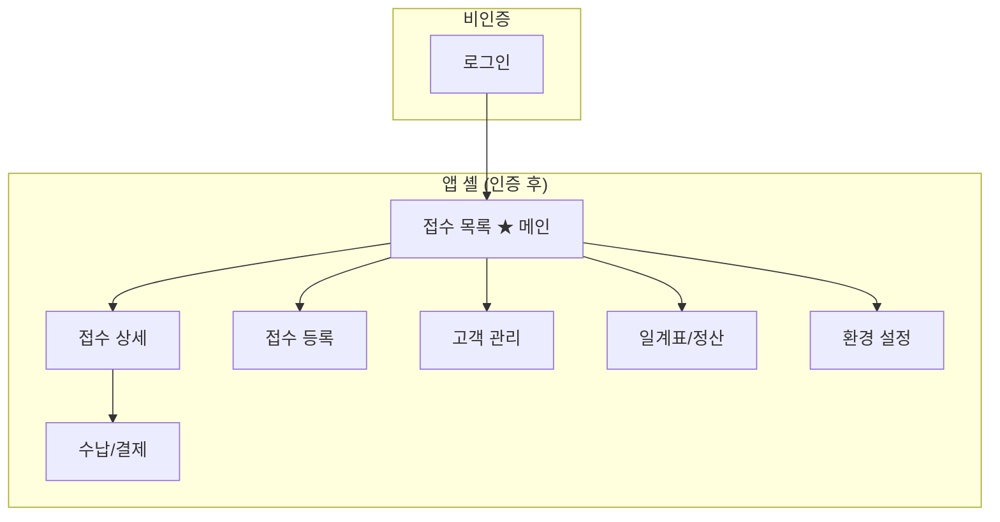
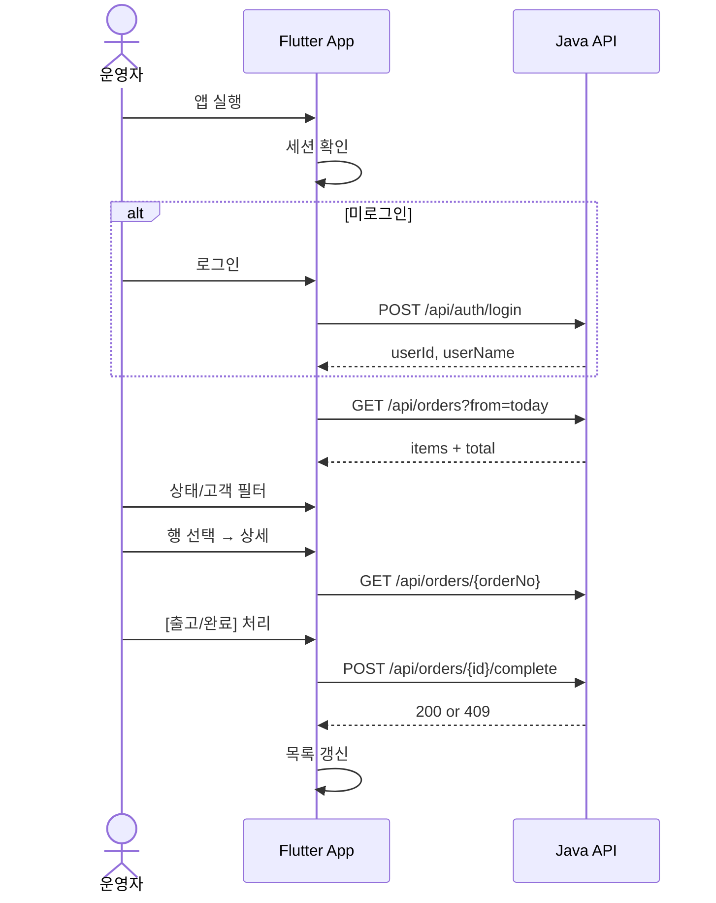

# IA — 정보구조(Information Architecture)

> **프로젝트**: TKLaundry Next  
> **작성/수정**: Geonho / 2026-05-25 / 초안  
> **근거 문서**: `00_레거시_분석.md`, `01_상세_기획서_PRD.md`, `04_API_규약.md`, `07_프로젝트_네이밍.md`

---

## 1. 목적·범위

차세대 Flutter Windows **관리자 앱**의 화면·내비게이션·우선순위를 정의한다.

- **대상 사용자**: 매장 운영자(관리자 1-role, 초기)
- **플랫폼**: Windows 데스크톱(1280×720 이상, 주 사용 1920×1080)
- **원칙**: 레거시 업무 흐름 유지 + 데스크톱에 맞는 정보 밀도·단축 동작

---

## 2. 프로젝트 현황 요약(2026-05-25)

| 영역 | 상태 | 비고 |
|------|------|------|
| 백엔드 로그인 API | ✅ 완료 | `POST /api/auth/login` |
| 백엔드 접수 조회 API | ⬜ 예정 | `GET /api/orders` (초안) |
| Flutter 앱 셸 | ⬜ 예정 | Hello World만 존재 |
| Flutter 로그인 화면 | ⬜ 예정 | API 연동 대상 |
| Flutter 접수 목록(메인) | ⬜ 예정 | P0 핵심 |

---

## 3. 앱 전체 구조(사이트맵)



> **병행 대조**는 레거시 앱 메뉴가 아니다. `05_DB_병행_및_마이그레이션.md`의 수기 기록·SQL 대조로 처리하며, **앱 화면으로 만들지 않는다.**

### 3.1 화면 우선순위(PRD·레거시 기준)

| ID | 화면명 | 레거시 사용빈도 | 전환 우선순위 | IA 그룹 |
|----|--------|:--------------:|:------------:|---------|
| S-01 | 로그인 | — | P0 | Auth |
| S-02 | **접수 목록** | ★★★ | **P0** | Order (메인) |
| S-03 | 접수 상세 | ★★★ | P0 | Order |
| S-04 | 상태 변경(모달/패널) | ★★★ | P0 | Order |
| S-05 | 접수 등록 | ★★★ | P1 | Order |
| S-06 | 수납/결제 | ★★☆ | P1 | Payment |
| S-07 | 고객 관리 | ★★☆ | P1 | Customer |
| S-08 | 일계표/정산 | ★★☆ | P2 | Report |
| S-09 | 환경 설정 | ★☆☆ | P2 | Settings |

> S-10「대조」는 초안에 앱 화면으로 넣었으나 **레거시에 없는 메뉴**이므로 제외. 병행 기간 대조는 접수 목록 합계 + `05_...` 수기 기록으로 한다.

---

## 4. 내비게이션 구조

### 4.1 레이아웃 패턴: **좌측 사이드바 + 상단 툴바 + 본문**

데스크톱 관리자 앱에 적합한 **Persistent Sidebar** 패턴을 사용한다.

```
┌─────────────────────────────────────────────────────────────┐
│ [로고] TKLaundry          오늘 2026-05-25    홍길동 ▾  │
├──────────┬──────────────────────────────────────────────────┤
│          │  [필터·검색·합계 바]                              │
│  접수    │  ┌────────────────────────────────────────────┐  │
│  고객    │  │              본문 (목록/상세)               │  │
│  정산    │  │                                            │  │
│  ─────   │  └────────────────────────────────────────────┘  │
│  설정    │                                                  │
└──────────┴──────────────────────────────────────────────────┘
```

### 4.2 1차 메뉴(사이드바)

| 메뉴 | 아이콘(개념) | 기본 랜딩 | P0 |
|------|-------------|----------|:--:|
| 접수 | inbox | 접수 목록 | ✅ |
| 고객 | person | 고객 목록 | P1 |
| 정산 | bar_chart | 일계표 | P2 |
| 설정 | settings | 환경 설정 | P2 |

> P0 구현 시 사이드바에는 **접수**만 활성, 나머지는 비활성(Coming soon) 또는 숨김.

### 4.3 2차 내비게이션(접수 그룹)

| 경로 | 설명 | 진입 |
|------|------|------|
| `/orders` | 접수 목록(메인) | 로그인 후 기본 |
| `/orders/:orderNo` | 접수 상세 | 목록 행 더블클릭·Enter |
| `/orders/new` | 접수 등록 | 상단 [+ 접수] 버튼 (P1) |

---

## 5. 화면별 정보 구조

### S-01. 로그인

| 구역 | 요소 | 비고 |
|------|------|------|
| 브랜드 | 로고, 앱명 `TKLaundry` | |
| 입력 | 아이디, 비밀번호 | Tab 순서 고정 |
| 액션 | [로그인] | Enter 제출 |
| 오류 | 인라인 오류 + traceId(접기) | API `401` |

**성공 후**: `/orders`로 이동, 사용자명·로그인 시각 세션 저장(로컬).

---

### S-02. 접수 목록 ★ 메인 화면

> 레거시의 **핵심 메인화면**. 하루 운영의 80%가 이 화면에서 시작된다.

#### 5.2.1 정보 계층

```
접수 목록
├── 필터 바 (1차: 기간 / 2차: 상태 / 3차: 검색)
├── 합계 바 (건수 · 총액 · 상태별 요약)
├── 데이터 테이블 (정렬·선택·키보드 이동)
└── 하단 상태바 (API 연결 · 마지막 갱신 · traceId)
```

#### 5.2.2 테이블 컬럼(P0)

| # | 컬럼 | 데이터 소스 | 정렬 | 비고 |
|---|------|------------|:----:|------|
| 1 | 접수번호 | `OrderMaster.OrderNo` | ✅ | PK 표시 |
| 2 | 접수일시 | `OrderMaster.OrderDate` | ✅ | 기본 내림차순 |
| 3 | 고객명 | `ComCustomer.CustName` | ✅ | |
| 4 | 연락처 | `ComCustomer.CustPhone` | — | 마스킹 표시 |
| 5 | 상태 | `OrderMaster.Status` → 코드명 | ✅ | 뱃지 |
| 6 | 결제구분 | Status 코드(B20001 등) | — | 일반/선불/외상 |
| 7 | 수량 | `OrderMaster.Qty` | — | |
| 8 | 금액 | `OrderMaster.Cost` | ✅ | 원, 천단위 구분 |
| 9 | 완료 | `CompleteYn` | — | Y/N 아이콘 |

#### 5.2.3 필터(P0)

| 필터 | UI | API Query | 기본값 |
|------|-----|-----------|--------|
| 기간 | 날짜 범위(DateRange) | `from`, `to` | **오늘** |
| 상태 | 멀티 셀렉트 칩 | `status` | 전체 |
| 검색 | 텍스트(고객명/전화) | `q` | 빈값 |

**빠른 기간 프리셋**: 오늘 · 어제 · 최근 7일 · 이번 달

#### 5.2.4 합계 바(P0 — 병행 대조 핵심)

| 지표 | 설명 |
|------|------|
| 총 건수 | 필터 조건 내 `COUNT` |
| 총 금액 | 필터 조건 내 `SUM(Cost)` |
| 상태별 건수 | 접수대기/작업중/완료/출고대기/출고완료/취소 |

---

### S-03. 접수 상세

| 구역 | 내용 |
|------|------|
| 헤더 | 접수번호, 상태 뱃지, [상태 변경] CTA |
| 고객 정보 | 이름 stepName, 전화, 주소(아파트/동/층/호) |
| 품목 테이블 | `OrderDetail` 라인(품목·공정·단가·수량·할인·금액·메모) |
| 금액 요약 | 수량합·할인합·총액 |
| 메타 | 접수일, 출고예정일, CompleteYn |
| 액션(P1) | [수납], [수정], [취소] |

**진입**: 목록에서 행 선택 → 우측 **마스터-디테일 패널**(1280+) 또는 전체 페이지(1024-).

---

### S-04. 상태 변경(오버레이)

P0 쓰기 1개. 레거시 후보: **출고 처리** 또는 **완료 처리**.

| 단계 | UI |
|------|-----|
| 1 | 현재 상태 표시 |
| 2 | 변경 가능 상태 목록(전이 규칙 적용) |
| 3 | 확인 다이얼로그(되돌릴 수 없음 경고) |
| 4 | 성공 → 목록/상세 갱신, 실패 → 오류+traceId |

---

### S-05 ~ S-09 (P1/P2 요약)

| ID | 핵심 IA |
|----|---------|
| S-05 접수 등록 | 고객 검색→품목 추가→합계→저장 (위저드 또는 단일 폼) |
| S-06 수납/결제 | 잔액 표시, 결제수단, 부분수납(P1 확인 후) |
| S-07 고객 관리 | 목록+상세 편집, 전화/이름 검색 |
| S-08 일계표 | 일별·기간별 매출 집계 테이블+차트(선택) |
| S-09 환경 설정 | 매장정보, 단가표(ComProduct), API 주소 |

---

## 6. 사용자 흐름(User Flow)

### 6.1 P0 일상 운영(가장 빈번)



### 6.2 병행 대조(앱 밖)

레거시 C# 앱과 동일하게 **전용 화면은 없다.**

```
접수 목록(차세대 합계) ↔ 레거시 접수 목록(합계) ↔ 05_... 수기 기록표
```

병행 기간에는 접수 목록 상단 **합계 바**로 차세대 수치를 확인하고, 레거시 앱·SQL과 대조한다.

---

## 7. Flutter 라우트·폴더 매핑

`07_프로젝트_네이밍.md` 구조를 따른다.

| 라우트 | 페이지 파일(예) | Feature |
|--------|----------------|---------|
| `/login` | `features/auth/login_page.dart` | auth |
| `/orders` | `features/order/order_list_page.dart` | order |
| `/orders/:orderNo` | `features/order/order_detail_page.dart` | order |
| `/orders/new` | `features/order/order_register_page.dart` | order |
| `/customers` | `features/customer/customer_list_page.dart` | customer |
| `/reports/daily` | `features/report/daily_report_page.dart` | report |
| `/settings` | `features/settings/settings_page.dart` | settings |

**앱 셸**: `shared/layout/app_shell.dart` — 사이드바+상단바+`child` 슬롯.

---

## 8. 상태·코드 IA (DB ↔ UI)

레거시 `ComBaseData` 코드를 UI 라벨로 매핑한다. **DB 코드값은 변경하지 않는다.**

### 8.1 접수 상태 (`B10001` 하위 — `[TODO]` 코드값 DB 확인)

| UI 라벨 | API enum(예) | DB 코드(예) | 뱃지 색(→ DS) |
|---------|-------------|-------------|--------------|
| 접수대기 | `RECEIVED` | `[확인]` | neutral |
| 작업중 | `IN_PROGRESS` | `[확인]` | info |
| 완료 | `COMPLETED` | `[확인]` | success |
| 출고대기 | `READY_TO_SHIP` | `[확인]` | warning |
| 출고완료 | `SHIPPED` | `[확인]` | success-muted |
| 취소 | `CANCELLED` | `[확인]` | error |

### 8.2 결제 구분 (`OrderMaster.Status` 내 B200xx)

| UI 라벨 | DB 코드 |
|---------|---------|
| 일반 | `B20001` |
| 선불 | `B20002` |
| 외상 | `B20005` |

---

## 9. 키보드·접근성(데스크톱)

| 단축키 | 동작 | 화면 |
|--------|------|------|
| `Ctrl+F` | 검색 포커스 | 접수 목록 |
| `Enter` | 선택 행 → 상세 | 접수 목록 |
| `F5` | 목록 새로고침 | 접수 목록 |
| `Esc` | 패널/다이얼로그 닫기 | 공통 |
| `↑/↓` | 행 이동 | 접수 목록 |

---

## 10. 미확정·오픈 이슈

| # | 항목 | IA 영향 | 확인 방법 |
|---|------|---------|----------|
| IA-01 | P0 쓰기 = 출고 vs 완료 | 상세 CTA 라벨·API path | 운영자 인터뷰 |
| IA-02 | 상세 = 우측 패널 vs 전면 페이지 | 1280 breakpoint | 프로토타입 테스트 |
| IA-03 | 상태 코드 전체 목록 | 필터·뱃지 | `ComBaseData` 조회 |
| IA-04 | 완료=출고대기 동일 여부 | 상태 필터 그룹핑 | 레거시 소스 |

---

## 11. 문서 이력

| 날짜 | 작성자 | 내용 |
|------|--------|------|
| 2026-05-25 | Geonho | 초안 — 레거시·PRD·현재 구현 상태 기반 IA |
